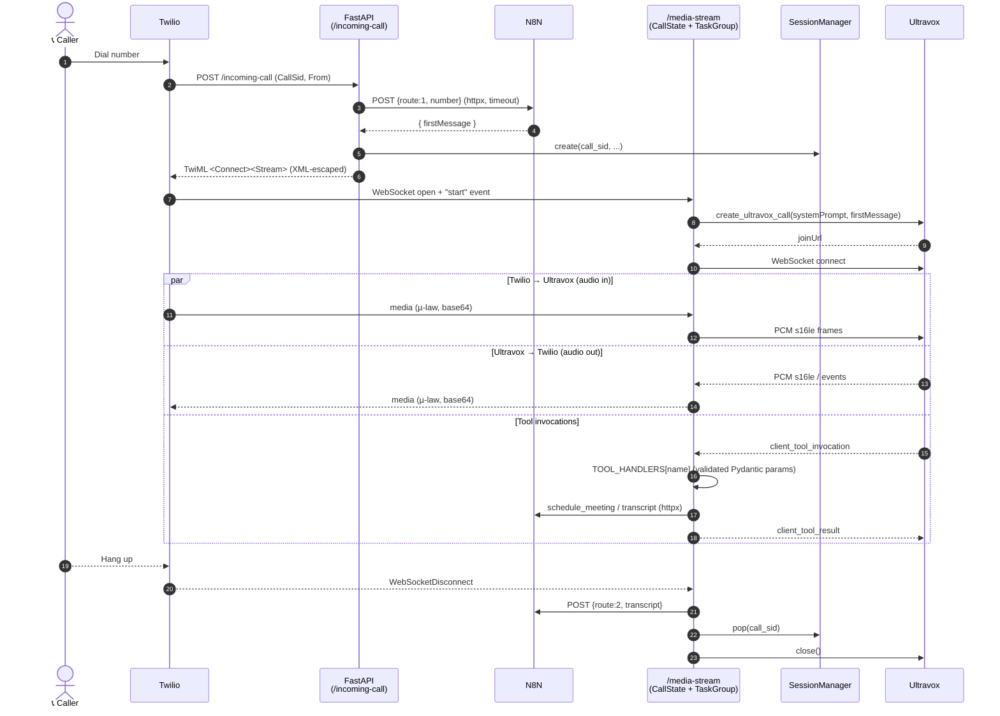
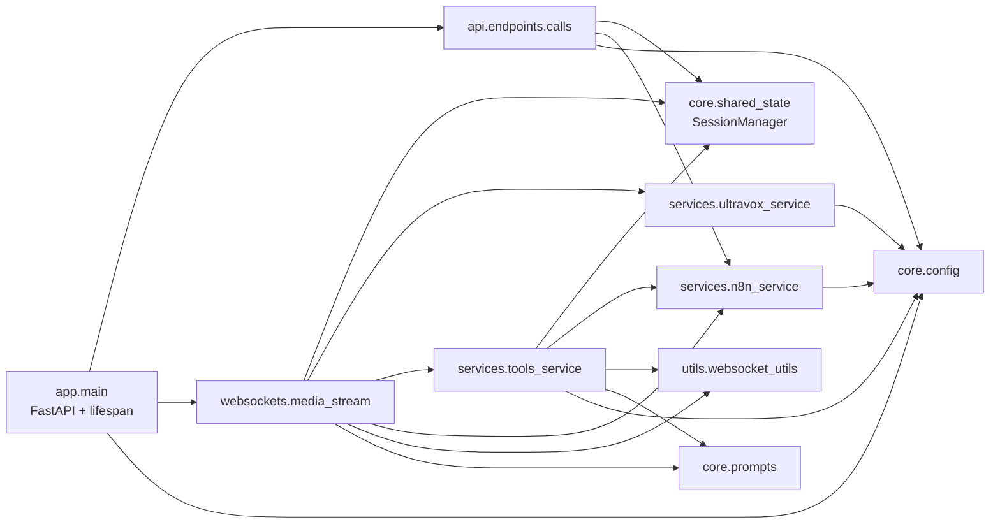

# VoxFlow: AI Receptionist

An intelligent voice receptionist powered by **Twilio** and **Ultravox** that handles phone calls with multi-stage conversation flows, WebSocket streaming, and automated workflow integration.

## Key Features

- **Voice AI Integration** - Twilio phone system with Ultravox AI processing
- **Multi-Stage Conversations** - Structured call flows with different voice personalities
- **Real-time Streaming** - WebSocket-based media streaming and data storage
- **Workflow Automation** - N8N integration for data processing and notifications
- **Smart Scheduling** - Calendar integration for meeting bookings across locations
- **Modular Architecture** - Clean, maintainable codebase with separation of concerns

## Quick Start

### Prerequisites
- Python 3.11+
- Twilio account with phone number
- Ultravox API key
- N8N webhook URL

### Installation

1. **Clone and setup**:
   ```bash
   git clone <repository-url>
   cd VoxFlow
   python -m venv venv
   source venv/bin/activate  # Windows: venv\Scripts\activate
   pip install -r requirements.txt
   ```

2. **Configure environment**:
   ```bash
   cp .env.example .env
   # Edit .env with your API keys and URLs
   ```

3. **Run the application**:
   ```bash
   uvicorn app.main:app --host 0.0.0.0 --port 8000 --reload
   ```

### Run with Docker

```bash
cp .env.example .env  # then fill in your credentials
docker compose up --build
```

The service will be available on `http://localhost:8000` (override with `PORT`).
The built image runs as a non-root user and exposes a `/health` endpoint used
by the compose healthcheck.

## Configuration

### Environment Variables

Required (the app fails to start if any are missing — see `validate_config()`):

```env
TWILIO_ACCOUNT_SID=your_twilio_sid
TWILIO_AUTH_TOKEN=your_twilio_token
TWILIO_PHONE_NUMBER=+1XXXXXXXXXX
ULTRAVOX_API_KEY=your_ultravox_key
N8N_WEBHOOK_URL=your_webhook_url
PUBLIC_URL=https://your-public-url
```

Optional (with defaults):

```env
PORT=8000
LOG_LEVEL=INFO
HTTP_TIMEOUT_SECONDS=10
ULTRAVOX_MODEL=fixie-ai/ultravox-70B
ULTRAVOX_VOICE=Tanya-English
ULTRAVOX_TEMPERATURE=0.1
ULTRAVOX_TURN_ENDPOINT_DELAY=0.384s
ULTRAVOX_CORPUS_ID=...
N8N_HMAC_SECRET=  # optional: enables HMAC-SHA256 signing of n8n requests
```

### Webhook authentication (HMAC)

When `N8N_HMAC_SECRET` is set, every outbound request to `N8N_WEBHOOK_URL`
includes an `X-VoxFlow-Signature: sha256=<hex>` header. The hex value is
`HMAC_SHA256(secret, raw_request_body)`. Verify it in n8n with a Function /
Code node:

```js
const crypto = require('crypto');
const secret = $env.N8N_HMAC_SECRET;
const sig = $request.headers['x-voxflow-signature'] || '';
const expected = 'sha256=' + crypto
  .createHmac('sha256', secret)
  .update($request.rawBody)
  .digest('hex');
if (!crypto.timingSafeEqual(Buffer.from(sig), Buffer.from(expected))) {
  throw new Error('Invalid signature');
}
return items;
```

Leave `N8N_HMAC_SECRET` unset to disable signing (backward compatible).

### Inbound Twilio signature validation

VoxFlow validates every request to `/incoming-call` and `/call-status` using
the `X-Twilio-Signature` header (HMAC-SHA1 with your `TWILIO_AUTH_TOKEN`).
Requests with missing / invalid signatures get a `403`. Disable for local
ngrok testing with `TWILIO_VALIDATE_SIGNATURE=false`.

### Outbound n8n retries

Transient n8n failures (timeouts, connection errors, 5xx responses) are
retried with exponential backoff. Tunable via `N8N_MAX_RETRIES` (default 3)
and `N8N_RETRY_BACKOFF_SECONDS` (default 0.5).

### Pre-built Docker images

Each push to `main` and every `v*` tag publishes an image to GHCR:

```bash
docker pull ghcr.io/faketut/voxflow:latest
docker run --env-file .env -p 8000:8000 ghcr.io/faketut/voxflow:latest
```

### Health & readiness

| Endpoint  | Status when healthy | Meaning                                    |
|-----------|---------------------|--------------------------------------------|
| `/health` | 200                 | Process is up. Use as liveness probe.      |
| `/ready`  | 200 / 503           | All required env vars are populated. Use as readiness probe. Body lists per-dependency status. |

### Structured logging

Set `LOG_FORMAT=json` to emit one JSON object per log line (production-friendly,
parseable by log aggregators). Default `LOG_FORMAT=text` keeps human-readable
output. `LOG_LEVEL` controls verbosity (default `INFO`).

### Twilio Setup
1. Purchase a Twilio phone number
2. Configure webhook: `https://your-public-url/incoming-call`
3. Set HTTP method to POST

### Local Development
Use ngrok for local testing:
```bash
ngrok http 8000
# Use the HTTPS URL as your PUBLIC_URL
```

## Architecture

```
VoxFlow/
├── app/
│   ├── api/endpoints/calls.py   # REST endpoints (/incoming-call, /outgoing-call, /call-status)
│   ├── core/
│   │   ├── config.py            # Env config + fail-fast validation
│   │   ├── prompts.py           # System prompts per call stage
│   │   └── shared_state.py      # SessionManager (asyncio.Lock per call)
│   ├── services/
│   │   ├── n8n_service.py       # Async webhook client (httpx)
│   │   ├── ultravox_service.py  # Ultravox call creation
│   │   └── tools_service.py     # TOOL_HANDLERS dispatch + Pydantic params
│   ├── utils/websocket_utils.py # safe_close_websocket
│   ├── websockets/media_stream.py # CallState + asyncio.TaskGroup
│   └── main.py                  # FastAPI app (lifespan startup)
├── requirements.txt
└── README.md
```

### Call flow



### Module dependencies



## Call Flow System

### Stage 1: Greeting & Authentication
- **Voice**: Tanya-English
- **Purpose**: Customer greeting and verification
- **Tools**: Query corpus, transition to main conversation

### Stage 2: Main Conversation
- **Voice**: Mark
- **Purpose**: Handle Q&A, scheduling, billing, emergencies
- **Tools**: Query corpus, schedule meetings, transition to summary

### Stage 3: Call Summary
- **Voice**: Tanya-English
- **Purpose**: Summarize call and confirm next steps
- **Tools**: Final queries, call termination

## Customization

### System Prompts
Edit `app/core/prompts.py` to customize:
- Assistant behavior and persona
- Call stage prompts
- Voice personalities

### Calendar Integration
Configure locations in `app/core/config.py`:
```python
CALENDARS_LIST = {
    "New York": "ny-office@example.com",
    "San Francisco": "sf-office@example.com",
    # Add more locations
}
```

### Adding Tools
Define a Pydantic model for the tool's parameters, write a handler, and register both in `app/services/tools_service.py`:

```python
class YourToolParams(BaseModel):
    foo: str

async def handle_your_tool(uv_ws, invocation_id, params: YourToolParams) -> None:
    # ...implement...
    await _send_tool_result(uv_ws, invocation_id, "done")

TOOL_HANDLERS["your_tool"] = (YourToolParams, handle_your_tool)
```

Also advertise the tool to Ultravox in `app/services/ultravox_service.py` (`_build_selected_tools`).

## Testing

1. **Make a test call** to your Twilio number
2. **Interact** with the AI assistant
3. **Verify** meeting bookings and data flow
4. **Check logs** for debugging

## Troubleshooting

- **Webhook unreachable**: Verify `PUBLIC_URL` and Twilio configuration
- **Ngrok URL changes**: Update `PUBLIC_URL` when ngrok restarts
- **API errors**: Check environment variables and API keys


---

**Built with**: FastAPI, Twilio, Ultravox, WebSockets, N8N
